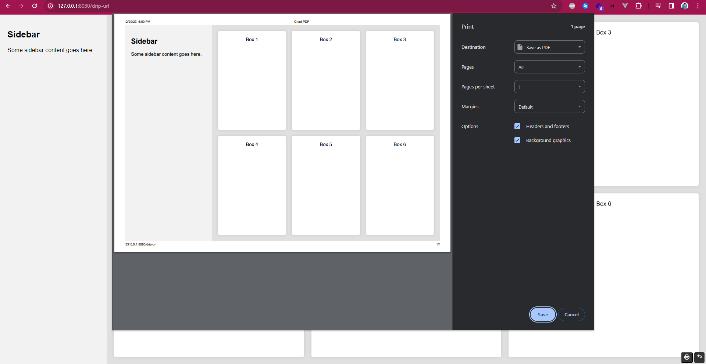

# Ctrl P

[](https://packagist.org/packages/medilies/ctrl-p)
[](https://github.com/medilies/ctrl-p/actions?query=workflow%3Arun-tests+branch%3Amain)
[](https://github.com/medilies/ctrl-p/actions?query=workflow%3A"Fix+PHP+code+style+issues"+branch%3Amain)
[](https://packagist.org/packages/medilies/ctrl-p)

## Setup

```bash
composer require medilies/ctrl-p
```

## Requirements

- PHP 8.1

## Usage

### Set the HTML

- Use `CtrlP::html('foo')` or `$ctrlP->setHtml('foo')` to set the HTML.
- Use `CtrlP::template('<?php echo "foo";', [])` or `$ctrlP->template('<?php echo "foo";', [])` to set the HTML from a PHP template.

### Set page size and orientation

- Use `format($paperFormat)` to set a standard paper format.
- Use `landscape()` or `portrait()` to direct the chosen paper format.
- Use `paperSize($width, $height)` to set an explicit size.

### Margin

Use `margins($margins)` to set the margins.

> Margins (header and footer) content cannot be be edited as of december 2023 because no browser supports it ([see](https://stackoverflow.com/a/77632288/17873304))

### Control

- Use `printButton($bool)` to add/remove a print button.
- Use `backUrl($url)` to add/remove a button with a link to a page of your choice.
- Use `autoPrint()` to automatically print the page after rendering it.

### Overrides

- Use `title($title)` to override the title.
- Use `urlPath($url)` to override the url path.

## Example

```php
<?php

// php -S 0.0.0.0:8080 .\this_file.php
// Visit http://127.0.0.1:8080/

use Medilies\CtrlP\CtrlP;

require_once __DIR__.'/../vendor/autoload.php';

echo CtrlP::html('
<!DOCTYPE html>
<html lang="en">
<head>
  <meta charset="UTF-8">
  <title>Flex and Grid HTML Page</title>
  <style>
    body {
      font-family: Arial, sans-serif;
      margin: 0;
      padding: 0;
    }

    .container {
      display: flex;
      height: 100vh;
    }

    .sidebar {
      background-color: #f2f2f2;
      width: 250px;
      padding: 20px;
    }

    .main-content {
      flex: 1;
      display: grid;
      grid-template-columns: 1fr 1fr 1fr;
      gap: 20px;
      padding: 20px;
      background-color: #e0e0e0;
    }

    .box {
      background-color: #fff;
      padding: 20px;
      border-radius: 5px;
      box-shadow: 0 0 10px rgba(0, 0, 0, 0.1);
      text-align: center;
    }
  </style>
</head>
<body>

  <div class="container">
    <div class="sidebar">
      <h2>Sidebar</h2>
      <p>Some sidebar content goes here.</p>
    </div>

    <div class="main-content">
      <div class="box">Box 1</div>
      <div class="box">Box 2</div>
      <div class="box">Box 3</div>
      <div class="box">Box 4</div>
      <div class="box">Box 5</div>
      <div class="box">Box 6</div>
    </div>
  </div>

</body>
</html>
    ')
    ->margins('1cm')
    // ->paperSize('130mm', '130mm')
    ->format('A4')
    ->landscape()
    ->title('Chad PDF')
    ->urlPath('/drip-url')
    ->autoPrint()
    ->printButton()
    ->backUrl('/some-path')
    ->get();
```


